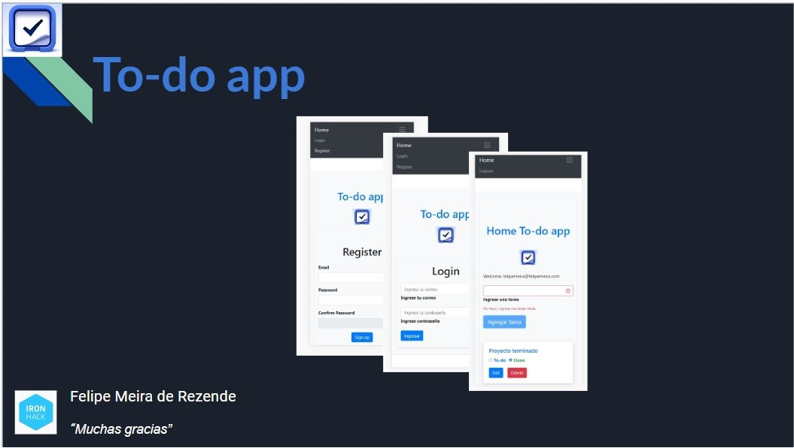

### Hi, I'm Felipe

<h1 align= "center">

</h1>


## About


**To-do app** El proyecto consiste en crear una aplicación de tareas sencillas con Vue.js que permita a los usuarios: 

Crear una cuenta;
Registrar tareas;
Editarlas y 
Marcarlas como completadas.


> Description.

## Built With

- Vue3
- Pinia
- Supabase
- Bootstrap

## Live Demo (if available)

[Template]https://github.com/FMRezende/TodoList.Project/tree/master

## Getting Started

To get a local copy up and running follow these simple example steps.

### Prerequisites

--Npm 
--Text editor (VsCode)

### Install

Instal To-do app with npm

```bash
npm install TodoList.Project
cd TodoList.Project
```

## Authors

👤 **Author1**

- GitHub: [https://github.com/FMRezende]
- LinkedIn: [https://www.linkedin.com/in/felipe-meira-de-rezende-55938286/]

## 🤝 Contributing

Contributions, issues, and feature requests are welcome!

## Show your support

Give a ⭐️ if you like this project!

## Acknowledgments

```
